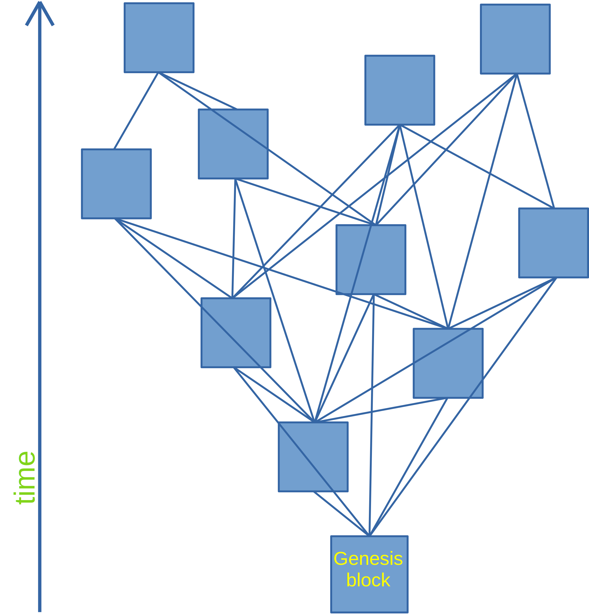

_how Walytis' non-linearity gives it unique properties_
# Main Differences Between Walytis and Classical Blockchains

## No Consensus Algorithm
In conventional blockchains like Bitcoin, nodes are constantly competing with each other to add the next block to the chain.
This is because agreement on the content of these old blockchains is reached via consensus algorithms by which nodes continually agree anew on the currently valid version of the blockchain history.

Walytis doesn't have a consensus algorithm.
Nodes don't compete for defining the entire blockchain history when adding a new block.
Instead, any node can publish a block at any time.

This form of growing the blockchain necessarily leads to a non-linear topology of block relationships.
Each block is linked to multiple blocks that came before it.
In other words, each block has multiple parent blocks.
To learn more about how exactly this linking works, see [Block-Chaining](../Technical/Block-Chaining.md).

## Security
Another major difference between Walytis and conventional blockchains like Bitcoin is that its security is not based on the difficulty of creating blocks.
Instead, the security of this blockchain partly lies more directly in decentralisation.
If a malicious node wants to change a block in the blockchain, it does not merely have to come up with a valid blockchain history with more blocks than the other nodes have like in Bitcoin, instead it has to change that block in the block records of the  of all the nodes it wants to convince of the fraudulent data by infiltrating them.
This is because once a node receives a block, it always trusts its own copy over those of others.

This aspect of Walytis' security is only one of many mechanisms.
To gain a full understanding of Walytis' methods for ensuring its integrity, see [Walytis Blockchain-Architecture Security](../Technical/WalytisBlockchainSecurity.md).

## Applications - Blockchain as a DBMS
Walytis is designed to be flexibly implementable by a wide range of different applications, such as communications systems, publishing platforms, public records etc, in short, any distributed system that needs a decentralised data-storage or coordination system.
In essence, Walytis serves applications as a decentralised database management system (DBMS).
Applications create Walytis blockchains for specific purposes, just like they might create conventional databases for specific purposes.
This stands in contrast to most conventional blockchain types,where each blockchain type usually has one universal blockchain which all applications use.

To learn more of this way of understanding blockchains, see [Understanding Blockchain](./UnderstandingBlockchain.md).

At the software level, applications remain separate pieces of software from the blockchains themselves, which run in the background as a service on the operating system.
Applications use the [`walytis_api` library ](../User/walytis_api-Overview.md)to tell their blockchains to create and publish new blocks and to get informed about newly published blocks by other nodes on the blockchain.

# The Double-Spending Problem
One interesting aspect of non-linear blockchains is how to solve the classic [double-spending problem](https://en.wikipedia.org/wiki/Double-spending), which was the use case blockchain technology was invented for in the first place.

As opposed to classical linear blockchains, where the double-spending problem is solved by its linear universally accepted transaction history (public ledger), the double-spending problem reemerges as a problem in nonlinear blockchains because they by design allow data to be added to it simultaneously.

In a non-linear blockchain, the double-spending problem of cryptocurrencies manifests itself as described in the following example:

> In an application for a cryptocurrency, Alice and Bob each make transactions in which they pay Chloe a sum of money.
> If they make the transactions practically simultaneously, and the application protocol requires the amounts of money in each account to be included in the block on which the transaction is published, then Alice will see Bob’s transaction as invalid because he has indicated a wrong sum on Chloe’s account because he hasn’t taken into account Alice’s transaction to her.
> Not only will Bob see Alice’s transaction as invalid in the same way, but all other participants in this cryptocurrency application will see one of the two transactions as invalid, depending on which block they receive and process first.

In the above example, we see two factors that cause this problem to arise:
- the transactions occur practically simultaneously
- the application protocol requires the amounts of money in each account to be included in the block on which the transaction is published

If we can make one of these conditions untrue, the double-spending problem is solved or eliminated.

We could of course remove the requirement on the cryptocurrency protocol to include the current amount of money of the involved accounts in the block.
That would, however, have the inefficiency of requiring applications to read through a large part of the cryptocurrency’s block history to validate each transaction.

The other option is to prevent transactions from occurring simultaneously.
This solution means the blockchain application, in this example the cryptocurrency, becomes responsible for keeping the transaction history linear.

We can make simultaneous transactions impossible at the application level by requiring each involved participant to confirm every transaction related to them:
Alice creates a block indicating that she wishes to send Chloe some money.
After waiting for a short duration to make sure the Alice isn't offering the same money to another person at the same time, Chloe creates a block confirming that she acknowledges this transaction.
If at the same time Chloe receives a block from Bob indicating that he wishes to send her money too, she first processes Alice' transaction and then processes his.

In effect, each participant becomes responsible for making sure that they themselves have a linear transaction history on the blockchain.

This solution to the double-spending problem demonstrates that such issues can be handled at the level of the blockchain applications, and not at the level of the blockchain itself.
The role of a Walytis blockchain is solely to interlink its blocks into an eternal self-indexing chronological database.
How this database is used is the concern of the blockchain applications.

The mechanisms for using Walytis blockchains in such a way to achieve linearity can be outsourced from applications, by building modules on top of Walytis that contain this functionality and present to applications an interface to a database-blockchain with different properties than Walytis.
See [Blockchain Overlays](/docs/Meaning/IntroductionToWalytis.md#blockchain-overlays) for details on this and other modules that provide other kinds of properties such as mutability and privacy.

# Chronology
Chronology is the set of features and properties of a blockchain which revolve around the questions of, assuming unreliable timestamps, if/how/when it is possible to determine which block in any pair of blocks was created first, or whether instead the pair of blocks must be treated as having been created at the same time.

In linear blockchains the chronology of the blocks is always clear, i.e. it is always clear which block came before which.
In non-linear blockchains the chronology is more limited.

All the blocks of a single node have clear chronological relationships to each other because a node can only create one block at a time.

For a pair of two blocks created by two different nodes, this is not necessarily the case.
If either of the blocks mentions the other in their block parent tree, their chronological relationship is clear.
Otherwise, it is not, and the two blocks must be considered to have been created simultaneously.

To learn how Walytis secures this system of determining block chronology against fraud, see [Walytis Blockchain-Architecture Security](../Technical/WalytisBlockchainSecurity.md#block-chronology-forgery)
